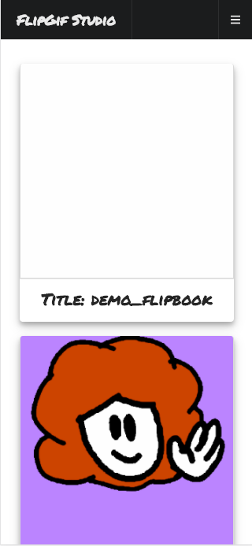
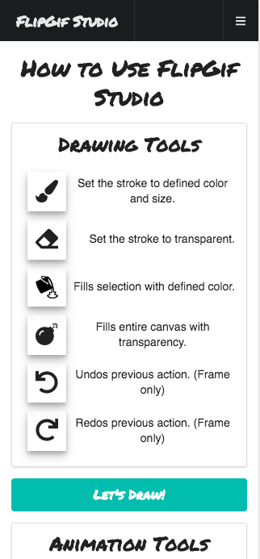
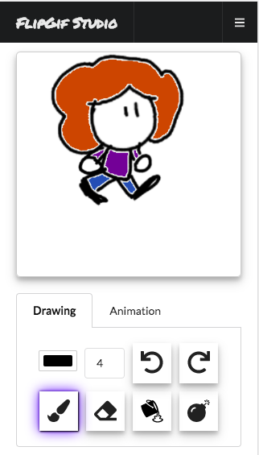
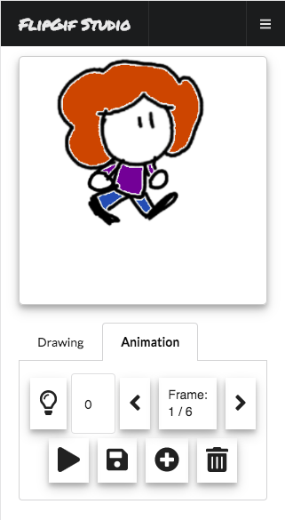
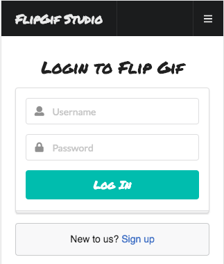
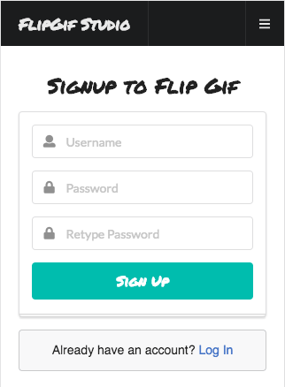

# FlipGif Studio

*Author: [Everett Abbott](https://github.com/AbbottEverett "Everett Abbott's GitHub")*

FlipGif Studio is mobile-first, web application which allows users to create their own animated gifs and share them with their friends. Using custom-made, browser-based drawing software, users can quickly sketch their ideas and bring them to life right on their phone!

FlipGif Studio was built in 2 weeks.

Note: FlipGif Studio's drawing tool is currently only supported in mobile.
### Live URL: http://flipgif-studio.surge.sh/#/
#### Frontend GitHub: https://github.com/AbbottEverett/flip-gif-front-end
#### Backend GitHub: https://github.com/AbbottEverett/flip-gif-back-end
#### Gif Service Github: https://github.com/AbbottEverett/flip-gif-gif-service

<iframe allowFullScreen frameborder="0" height="564" mozallowfullscreen src="https://player.vimeo.com/video/265487343" webkitAllowFullScreen width="640"></iframe>

## Features
- Browser based drawing tool which includes changing brush color, changing brush size, fill tool, clear tool, undo, redo, lightbox (see frames near to the one you are on), add frame, remove frame, save to server.
- Drawing tool state managed using the Redux store.
- Leveraging Amazon S3, HTML5 Canvas API and a GIFEncoder in order to dynamically create and upload .gif files based from the drawings made in the tool.
- User authenticated routes and resources in order to protect the security of users work, passwords, etc.

## Technologies
#### Frontend
- React.js
- React Redux
- React Router
- HTML5 Canvas 
- Semantic-UI
- JSX
- JavaScript
- AJAX/axios

#### Backend
- PostgreSQL
- Amazon S3
- Authentication
- Knex.js
- Node.js
- Express.js
- REST API

## Screenshots
### Home Page View:

### Tutorial Page View:

### Flipbook Drawing View:

### Login / Signup View:

